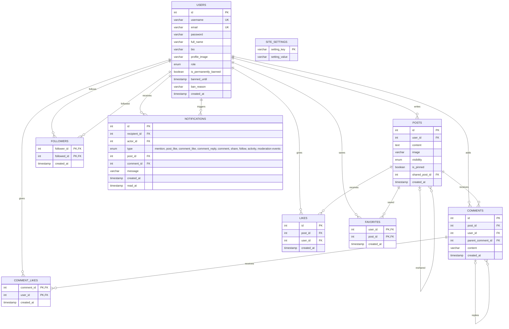

# Entity Relationship Diagram

```mermaid
erDiagram
    USERS ||--o{ POSTS : writes
    POSTS o|--o{ POSTS : reshared
    USERS ||--o{ COMMENTS : adds
    POSTS ||--o{ COMMENTS : receives
    COMMENTS o|--o{ COMMENTS : replies
    USERS ||--o{ LIKES : gives
    POSTS ||--o{ LIKES : receives
    USERS ||--o{ FOLLOWERS : follows
    USERS ||--o{ FOLLOWERS : followed
    USERS ||--o{ FAVORITES : saves
    POSTS ||--o{ FAVORITES : saved
    USERS ||--o{ COMMENT_LIKES : gives
    COMMENTS ||--o{ COMMENT_LIKES : receives
    USERS ||--o{ NOTIFICATIONS : receives
    USERS ||--o{ NOTIFICATIONS : triggers
    SITE_SETTINGS {
        varchar setting_key PK
        varchar setting_value
    }

    USERS {
        int id PK
        varchar username UK
        varchar email UK
        varchar password
        varchar full_name
        varchar bio
        varchar profile_image
        enum role
        boolean is_permanently_banned
        timestamp banned_until
        varchar ban_reason
        timestamp created_at
    }
    POSTS {
        int id PK
        int user_id FK
        text content
        varchar image
        enum visibility
        boolean is_pinned
        int shared_post_id FK
        timestamp created_at
    }
    COMMENTS {
        int id PK
        int post_id FK
        int user_id FK
        int parent_comment_id FK
        varchar content
        timestamp created_at
    }
    LIKES {
        int id PK
        int post_id FK
        int user_id FK
        timestamp created_at
    }
    FOLLOWERS {
        int follower_id PK, FK
        int followed_id PK, FK
        timestamp created_at
    }
    FAVORITES {
        int user_id PK, FK
        int post_id PK, FK
        timestamp created_at
    }
    COMMENT_LIKES {
        int comment_id PK, FK
        int user_id PK, FK
        timestamp created_at
    }
    NOTIFICATIONS {
        int id PK
        int recipient_id FK
        int actor_id FK
        enum type "mention, post_like, comment_like, comment_reply, comment, share, follow, activity, moderation events"
        int post_id FK
        int comment_id FK
        varchar message
        timestamp created_at
        timestamp read_at
    }
```